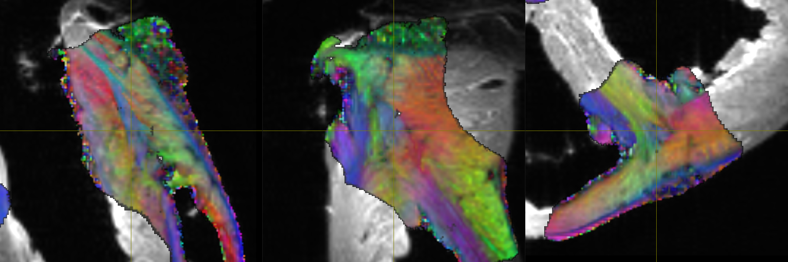
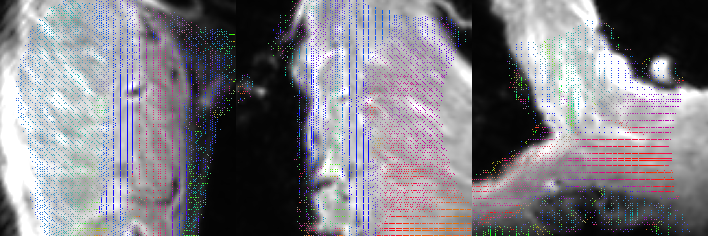
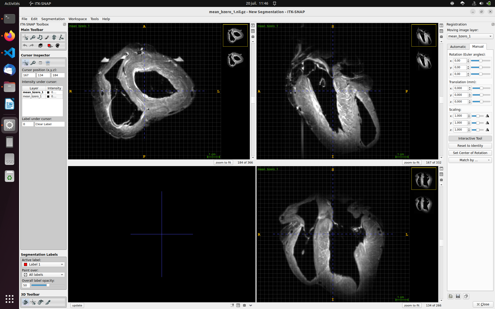
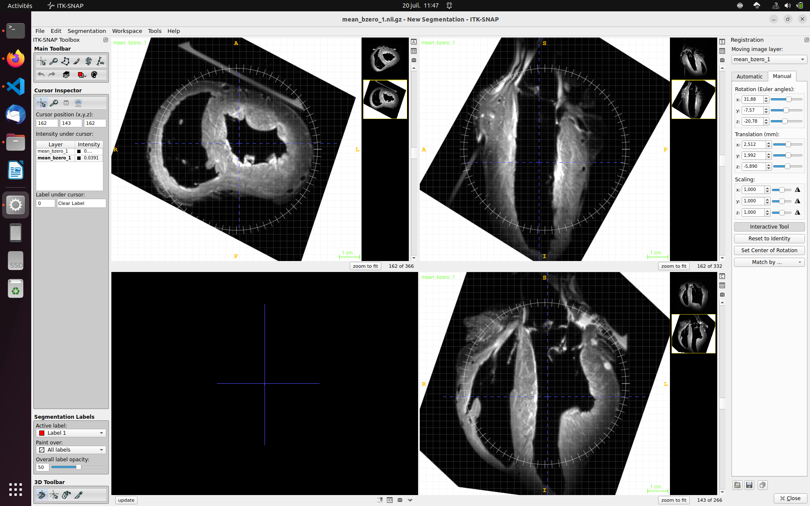
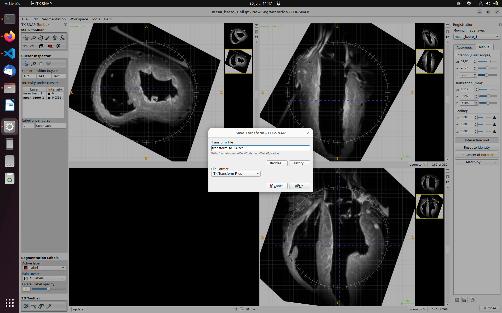
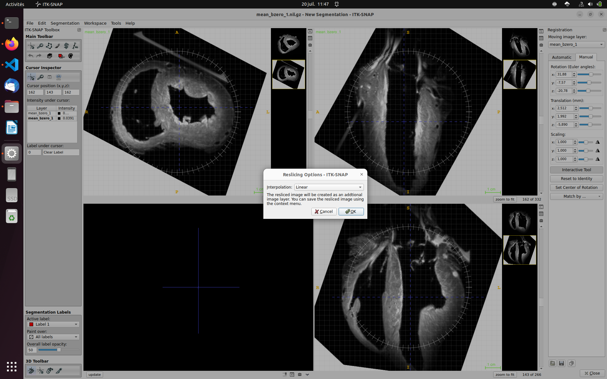

# Tutorial for computation and reorientation of the cardiac diffusion tensor metric 

Here is a brief tutorial for tensor reorientation. Largely inspired from https://github.com/ANTsX/ANTs/wiki/Warp-and-reorient-a-diffusion-tensor-image.

# Acknowledgments

The author is grateful for the help provided via the Github or Discourse platform by Philip Cook and Nick Tustison regarding the use of ANTs and Max Pietsh, Robert Smith and Donald Tournier regarding the use of MRtrix3 software. 

# References
Here are relevent references for this script in cardiac DTI: 

```
Rodriguez Padilla J, Petras A, Magat J, Bayer J, Bihan-Poudec Y, El-Hamrani D, Ramlugun G, Neic A, Augustin C, Vaillant F, Constantin M, Benoist D, Pourtau L, Dubes V, Rogier J, Labrousse L, Bernus O, Quesson B, Haissaguerre M, Gsell M, Plank G, Ozenne V, Vigmond E. Impact of Intraventricular Septal Fiber Orientation on Cardiac Electromechanical Function. Am J Physiol Heart Circ Physiol. 2022 Mar 18. doi: 10.1152/ajpheart.00050.2022. Epub ahead of print. PMID: 35302879.
```

```
Magat J, Yon M, Bihan-Poudec Y, Ozenne V (2022) A groupwise registration and tractography framework for cardiac myofiber architecture description by diffusion MRI: An application to the ventricular junctions. PLOS ONE 17(7): e0271279. https://doi.org/10.1371/journal.pone.0271279
```

# Environnement

ANTs and MRtrix are mandatory dependencies. ITK-SNAP and 3DSlicer may be usefull as well. 

Check that the command antsRegistration is in the path of your sytem. 

```
valery:~/Dev/Cardiac-Structure-Database$ antsRegistration --version
ANTs Version: 2.4.4.post12-g8cc4f8a
Compiled: May 25 2023 10:33:31
```

## OS version

Distributor ID:	Ubuntu
Description:	Ubuntu 22.04.2 LTS
Release:	22.04
Codename:	jammy
 
## MRtrix version
== mrinfo 3.0.4-39-ga5e5ae85 ==
64 bit release version, built May 25 2023, using Eigen 3.4.0
Author(s): J-Donald Tournier (d.tournier@brain.org.au) and Robert E. Smith (robert.smith@florey.edu.au)
Copyright (c) 2008-2023 the MRtrix3 contributors.

## ANTs version
ANTs Version: 2.4.4.post12-g8cc4f8a
Compiled: May 25 2023 10:33:31

## Code 

A code for the computation and reorientation of the diffusion tensor metric in `Code` folder. The code is subject to change at any moment. As an example, the code automatically produces the following figures: 

## Figures

Sample in initial orientation


Sample after reorientation
 

cFA and v1 in initial orientation




cFA and v1 after reorientation
 
 


## Data

## Data folder

The data are available on the Zenodo Platform. The "Native" folder of sample was used in this example. 

* v0.2 [](https://doi.org/10.5281/zenodo.5156088) 

```
├── Data
│   ├── 1
│   │   ├── Native
│   │   │   ├── Angles
│   │   │   └── Vectors
```

## Mandatory.

When converting your DWI from DICOM or Bruker file to nii.gz. For instance using mrconvert. Please check the strides order is [ 1 2 3 4 ], ortherwise it won't works. Use [mrconvert](https://mrtrix.readthedocs.io/en/dev/reference/commands/mrconvert.html) using "-strides" option to fix it if necessary.

In some cases (when merging multiple combinations of linear and non linear reorientation as a composite transform ), it may not works.
Please check: [issue](https://github.com/ANTsX/ANTs/issues/1137)

```
************************************************
Image name:          "Tutorial_for_Lucy/Data/1/Native/dwi_raw_1_4D.mif"
************************************************
  Dimensions:        332 x 266 x 366 x 9
  Voxel size:        0.301205 x 0.300752 x 0.300546 x 1
  Data strides:      [ 1 2 3 4 ]
  Format:            MRtrix
  Data type:         32 bit float (little endian)
  Intensity scaling: offset = 0, multiplier = 1
  Transform:                    1           0          -0      -47.93
                                0           1          -0      -55.59
                                0           0           1      -42.69
  command_history:   xxxxxxxxxxx
  dw_scheme:         0,0,0,0
  [9 entries]        0,0,0,0
                     ...
                     0.2864058917,0.8171218106,0.5002835314,1000
                     -0.5031730922,0.8422151373,-0.1936246417,1000
  mrtrix_version:    3.0.2-108-g6844eb03

```

Therefore the tensor should looks like this:

```
valery:~/Dev/Cardiac-Structure-Database$ mrinfo Tutorial_for_Lucy/Data/1/Native/tensor_1_4D.nii.gz 
************************************************
Image name:          "Tutorial_for_Lucy/Data/1/Native/tensor_1_4D.nii.gz"
************************************************
  Dimensions:        332 x 266 x 366 x 6
  Voxel size:        0.301205 x 0.300752 x 0.300546 x 1
  Data strides:      [ 1 2 3 4 ]
  Format:            NIfTI-1.1 (GZip compressed)
  Data type:         32 bit float (little endian)
  Intensity scaling: offset = 0, multiplier = 1
  Transform:                    1           0           0      -47.93
                                0           1           0      -55.59
                                0           0           1      -42.69
  comments:          untitled
  mrtrix_version:    3.0.2-108-g6844eb03
```

## ITK-SNAP wiki

ITK-SNAP is the reference software for ANTs. 
Check this: https://github.com/ANTsX/ANTs/wiki/Using-ITK-SNAP-with-ANTs

You can define the linear transform either manually or from registration. 

* step 1, open the mean_b0 image:
```
itksnap -g ${MEAN_NII} -o ${MEAN_NII}
```
* go to Tools/Registration
* click manual
* on the right panel, move and rotate the sample

* if necessaru , you can display both images as overlay

* using the disk icon, save the transformation

* you can save also the image after linear interpolation is the new space


* it can necessary to pad this image as a next processing step. the long axis of the sample is usually in our case aligned with diagonal of the image. The alignement of the sampel in the y direction of the image could crop the base or apex of the sample.


